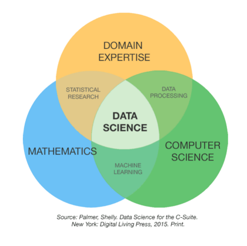

# 데이터 사이언스란?

데이터 사이언스란, 데이터 마이닝(Data Mining)과 유사하게 정형, 비정형 형태를포함한 다양한 데이터로부터 지식과 인사이트를 추출하는데 과학적 방법론, 프로세스, 알고리즘, 시스템을 동원하는 융합분야다. (Wikipedia)

→ 구글링을 할 수록 개념이 뒤죽박죽 …!

<table>
  <tr>
    <td></td>
    <td>

- 도메인 지식 (경험)
- 컴퓨터 과학
- 수학
  → 의 교집합!  
  : 데이터 사이언스의 이상향..!    

> 어차피 이 모든 역량을 완벽히 맞추기는 어려우므로,   자신에 맞게 중점을 두고 산업 분야와 도메인에 경험을 쌓자!

  <tr>
</table>
