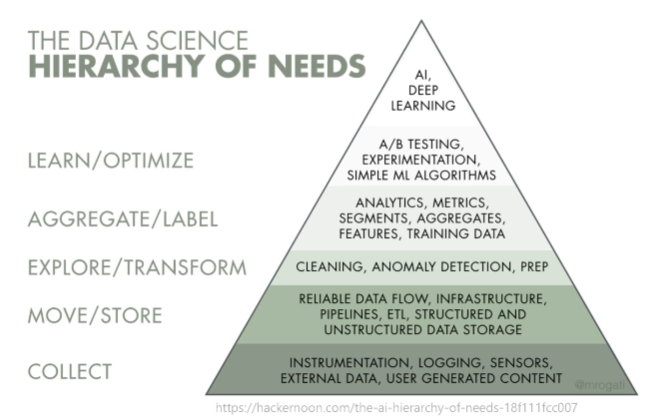

# FAQ 자주 하는 질문

### Q. 데이터 사이언스 관련 전공은?

> 컴공, 소웨공, 수학, 통계학 …

- 굳이 대학원을 간다면?
  - AI 대학원, Big Data MBA, 해외 온라인 석사
    (조지아텍, 미시건, UIUC 등… ⇒ 졸업하기가 매우 어렵다고!)
    → 실력만 있다면 석사는 필요하지 않다! 오픈소스 컨텐츠를 활용해보자.
- 비전공자라면?
  - ‘프로젝트’로 ‘함께’ 공유해보자!
  - kaggle,.. 등을 활용하자

### Q. 어떤 과목을 학습해야 할까요?

1. 분석 도구 (R, Python…)
2. 분석 기법 (통계학, 머신러닝)
3. 현업 지식

### Q. 어떤 직무들이 있나요?

작은 회사라면 이걸 혼자서 전부 해야 한다,,,!

큰 회사일 수록 점차 나눠지는 것.

### Q. 현업에선 어떤 툴을 많이 쓰나요?

> 태블로와 같은 유료툴을 많이 사용합니다.

1. 주피터 노트북
   - 분석 결과물 공유를 위한 도구로서의 표준
   - interactive notebook..!
2. git
   - 코드의 버전 관리를 위한 표준
   - 분석을 코드로 하는 이상 협업을 위해 꼭 알아야 하는 도구

> 개발 언어

1. SQL
   - 많은 곳에서 기본으로 사용하는 도구
   - 분석을 위한 sql은 crud 중 r만 이해해도 좋다!
2. Python
   - 거대한 생태계, 모든 사람들이 할 줄 아는 언어임.
3. R언어
   - 학계 생태계의 든든한 서포트
     → 개발보단 통계와 같은 학술적인 용도로 주로 사용.
   - 엑셀과 같은 형태의 (테이블 형태) 데이터를 다루어야 한다면 추천

### Q. 용어….!

> 데이터 리터러시

- 리터러시 = 문해력 (읽고 쓰는 능력)
  ⇒ 데이터를 이해하고 분석하고 활용할 수 있는 전반적인 능력.

> 데이터 마이닝

- 마이닝 = 채굴
  ⇒ 데이터 안의 가치 있는 정보와 의미들을 찾아낸다!
- 데이터 분석과의 차이?
  - 데이터 분석: 데이터 수집, 정제, 분석, 의사결정, 커뮤니케이션을 위한 시각화까지의 일련의 과정
  - 데이터 마이닝은 데이터 분석이라는 큰 프로세스 안에 있는 개념!

> 인공지능 (가장 큰 개념)

- 지능형 기계를 만드는 과학과 공학
  ⇒ 인간처럼 사고하는 기계를 만든다! - 계산적인 부분에서의 인간적인 사고 \* 이미지 분류 .. 등 - 지적인 능력! 감성적, 감정적인 부분이 아직 아님.

> 머신 러닝

- 사람이 직접 코드를 주입하지 않아도, 데이터로부터 기계가 직접 학습하고 수행하는 알고리즘을 개발하는 연구 분야

> 딥 러닝

- 머신 러닝의 방법론 中 하나
  - 빅데이터에서 규칙과 패턴을 잘 찾아내고 이를 통해 의사결정, 예측이 용이해짐.
- 인공신경망의 한계를 극복한 알고리즘
