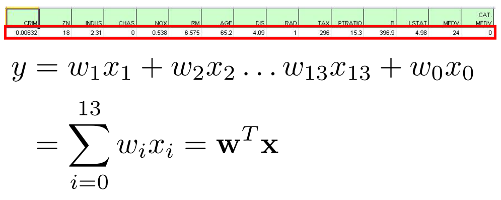

# 머신러닝이란?

### Machine Learning Process

기존에 있는 데이터를 알고리즘을 사용하여 모델을 만들어내고,
새로운 데이터를 통해 모델을 적용하여 예측을 해내는 과정.

**⇒ 핵심은 머신러닝 알고리즘과 모델을 배우는 것!**

[스타트업 스토리 플랫폼-플래텀(Platum)](https://platum.kr/archives/83757)

### Key Concepts

- **Model**
  - 예측을 위한 수학 공식, 함수
  - 1차 방정식, 확률분포, condition rule
- **Algorithms**
  - 어떠한 문제를 풀기 위한 과정
  - Model을 생성하기 위한 (훈련) 과정

### 모델을 학습할 때 영향을 주는 것들

알고리즘을 사용하여 y값을 결정하는 최적의 a, b를 결정한다!

⇒ 물론 이렇게 y값에 영향을 주는 변수 x는 **하나가 아니다!**

### Feature

- 머신러닝에서 데이터의 특징을 나타내는 변수
- feature, 독립변수, input 변수 등은 동일의미로 사용
- 일반적으로 Table 상에 Data를 표현할 때, Column을 의미
- 하나의 data instance (실제 데이터)는 feature vector로 표현

### 예제 - Boston House Pirce Dataset

- Toy Dataset

[가비아 호스팅 서비스:웹호스팅,웹메일호스팅,쇼핑몰호스팅,단독서버,동영상호스팅](http://www.dator.co.kr/ctg258/textyle/1721307)

[Boston Dataset](http://www.cs.toronto.edu/~delve/data/boston/bostonDetail.html)

- 13개의 x 변수, 1개의 y변수… 등이 필요함
  ⇒ x 변수의 실제 데이터는 특징(**feature**)을 나타낸다!

### Feature vector

x^(1) 에서의 첫번째 원소와 w 에서의 첫번째 원소는 상수값임.

- 참고)
  - Scalar는 이탤릭체
  - vector는 소문자 볼드
  - matrix는 대문자 볼드

### Feature

### 강의에서 쓰는 용어

- Data table: 전체 테이블
- column: attribute, feature…
- instance, tuple, row: 한 명의 데이터
- Feature vector: column에 있는 데이터의 모음
- data: 한 셀의 데이터

### Pandas

> 엑셀처럼 데이터를 핸들링하게 해준다!

- 구조화된 데이터의 처리를 지원하는 Python 라이브러리
- 고성능 Array 계산 라이브러리인 Numpy와 통합하여,
  강력한 “스프레드시트” 처리 기능을 제공
- 인덱싱, 연산용 함수, 전처리 함수 등을 제공함
