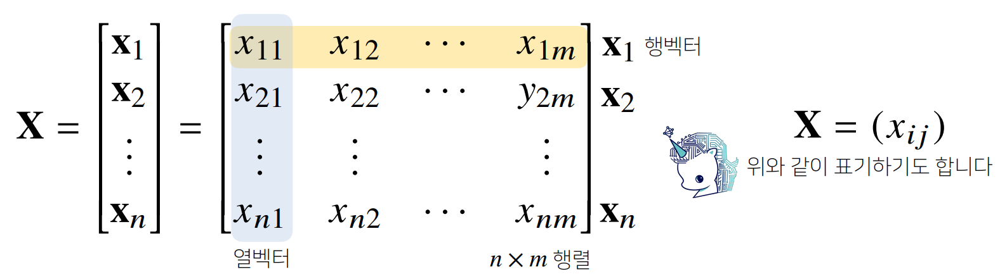

# 행렬이란?

태그: 2주차

# 행렬이란?

## 행렬의 기본 개념

---

행렬(matrix)은 벡터를 원소로 가지는 2차원 배열

- 행(row)과 열(column)이라는 인덱스(index)를 가짐.
- 행렬의 특정 행(열)을 고정하면 행(열)벡터라고 부름.

```python
X = np.array([[1, -2, 3],
							[7, 5, 0],
							[-2, -1, 2]])
```



- 전치행렬은 **행과 열의 인덱스가 바뀐 행렬**을 말함.


## 행렬을 이해하기 - (1)

---

- 벡터가 공간에서 한 점을 의미한다면 행렬은 여러 점들을 나타냄.
- 행렬의 행 벡터 Xi는 i번째 데이터를 의미함.
- 행렬의 Xij는 i번째 데이터의 j번째 변수의 값을 말함.


## 행렬의 덧셈, 뺄셈, 성분곱, 스칼라곱

---

- 행렬은 벡터를 원소로 가지는 2차원 배열.
- 행렬끼리 같은 모양을 가지면 덧셈, 뺄셈을 계산할 수 있음.
  ⇒ 벡터의 덧뺄셈과 동일함.
- 성분곱, 스칼라곱 역시도 벡터와 동일
  - 성분곱은 각 인덱스 위치끼리 곱함.
  - 스칼라곱은 모든 성분에 똑같이 숫자를 곱해줌.

## 행렬의 곱셈

---

행렬 곱셈(matrix multiplication)은 **i번째 행벡터와 j번째 열벡터 사이의 내적을 성분**으로 가지는 행렬을 계산함.


- `numpy`에서는 `@`연산을 사용함.
  - 아래 예시에서 `-8`은 `1*0 + (-2)*1 + 3*(-2)` 을 계산하여 도출됨.

```python
X = np.array([[1, -2, 3],
							[7, 5, 0],
							[-2, -1, 2]])

Y = np.array([[0, 1],
							[1, -1],
							[-2, 1]])

X @ Y
```

```python
array([-8, 6],
			[5, 2],
			[-5, 1]])
```

## 행렬의 내적

---

- 넘파이의 `np.inner`는 **i번째 행벡터와 j번째 행벡터 사이의 내적을 성분**으로 가지는 행렬을 계산함.
  - 수학에서 말하는 내적과는 다르므로 주의!
  - 아래 예제에서 `-5`는 `1 * 0 + (-2) * 1 + 3 * (-1) = -5` 로 도출됨.

```python
X = np.array([[1, -2, 3],
							[7, 5, 0],
							[-2, -1, 2]])

Y = np.array([[0, 1, -1],
							[1, -1, 0]])

np.inner(X, Y)
```

```python
array([-5, 3],
			[5, 2],
			[-3, 1]])
```

## 행렬을 이해하기 - (2)

---

- 행렬은 벡터공간에서 사용되는 연산자(operator)로 이해함.
- 행렬곱을 통해 벡터를 다른 차원의 공간으로 보낼 수 있음.
- 행렬곱을 통해 패턴을 추출할 수 있고 데이터를 압축할 수도 있음.


## 역행렬

---

- 어떤행렬 A의 연산을 거꾸로 되돌리는 행렬을 **역행렬(inverse matrix)**이라 부르고 A-1라 표기.
- 역행렬은 **행과 열 숫자가 같고, 행렬식(determinant)이 0이 아닌 경우**에만 계산할 수 있음.


- `numpy.linalg.inv`로 구할 수 있음.

```python
X = np.array([[1, -2, 3],
							[7, 5, 0],
							[-2, -1, 2]])

np.linalg.inv(X)
```

- 만일 역행렬을 계산할 수 없다면 **유사역행렬(pseudo-inverse)** 또는 **무어펜로즈(Moore-Penrose)역행렬 A+** 을 이용한다
  - 행과 열의 숫자가 달라도 계산이 가능.


- `numpy.linalg.pinv` 로 구할 수 있음.
  - pinv? pseudo-inverse

```python
Y = np.array([[0, 1],
							[1, -1],
							[-2, 1]])

np.linalg.pinv(Y)
```

## 응용1: 연립방정식 풀기

---

- `np.linalg.pinv` 를 이용하면 연립방정식의 해를 구할 수 있다.
  - 유사 역행렬을 사용하여 구할 수 있음.


## 응용2: 선형회귀 분석

- `np.linalg.pinv` 를 이용하면 데이터를 선형모델(linear model)로 해석하는 **선형회귀식**을 찾을 수 있다.
  1. L2-노름을 최소화
  2. Moore-Penrose 역행렬을 이용하면 y에 근접하는 y^ 를 찾을 수 있음.
- `sklearn`의 `LinearRegression`과 같은 결과를 가져올 수 있음.
