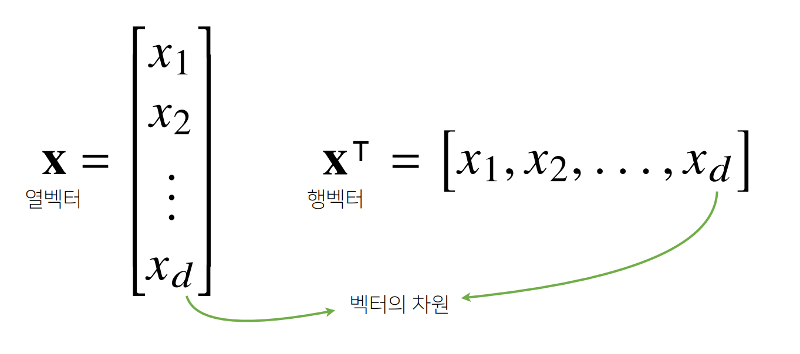

# 벡터란?

Mathematics for Artificial Intelligence

## 벡터의 기본 원리들

---

벡터는 숫자를 원소로 가지는 리스트(list) 또는 배열(array) 입니다.

```python
x = [1, 7, 2]
	x = np.array([1, 7, 2]) # row vector
```

- 열벡터와 행벡터는 **방향**으로 구분!

벡터의 차원? 보통 벡터 안의 숫자들의 개수!



- 벡터는 공간에서의 한 점을 나타냄
- 벡터는 원점으로부터 상대적 위치를 표현하는 것!


- 벡터에 숫자를 곱해주면 길이만 변화함.
  - 1보다 크면 길이가 늘어나고, 1보다 작으면 길이가 줄어듦
  - 단, 0보다 작으면 **반대 방향**이 됨.


- 벡터끼리 **같은 모양**을 가지면 덧셈, 뺄셈을 계산할 수 있음.


- 벡터끼리 같은 모양을 가지면 성분곱(Hadamardproduct)을 계산 가능.

```python
import numpy as np

x = np.array([1, 7, 2])
y = np.array([5, 2, 1])

x + y # array([6, 9, 3])

x - y # array([-4, 5, 1])

x * y # array([5, 14, 2])
```

## 벡터의 덧셈과 뺄셈

---

- 두 벡터의 덧셈은 다른 벡터로부터 상대적 위치 이동을 표현.


- 뺄셈은 방향을 뒤집은 덧셈으로 이해하면 됨!

## 벡터의 노름 구해보기

---

- 벡터의 노름(norm)은 원점에서부터의 거리를 말함.
  - || || 기호를 노름(norm)이라 부름.
  - d = 임의의 차원 → 임의의 차원에서 모두 성립함.

1. L1-노름은 각 성분의 변화량의 절대값을 모두 더하는 것!
2. L2-노름은 피타고라스 정리를 이용해 유클리드 거리를 계산함!


```python
def l1_norm(x):
	x_norm = np.abs(x)
	x_norm = np.sum(x_norm)
	return x_norm

def l2_norm(x):
	x_norm = x*x
	x_norm = np.sum(x_norm)
	x_norm = np.sqrt(x_norm)
	return x_norm
```

→ 참고: L2 노름은 `np.linalg.norm`을 이용해도 구현 가능함.

### 다른 노름들이 필요한 이유?

- 노름의 종류에 따라 기하학적 성질이 달라지기 때문.
- 머신러닝에선 각 성질들이 필요할 때가 있으므로 둘 다 사용함.


## 벡터 사이 거리 구하기

---

- L1, L2 노름을 이용해 두 벡터 사이의 거리를 계산할 수 있음.
- 두 벡터 사이의 거리를 계산할 때는 벡터의 뺄셈을 이용함.
  - x → y 이동 거리와 y-x 벡터가 동일함.
- 뺄셈을 거꾸로 해도 거리는 동일함.
  - || x - y || = || y - x ||


## 벡터 사이 각도 구하기

---

- 제2 코사인 법칙에 의해 두 벡터 사이의 각도를 계산할 수 있음.


- 분자를 쉽게 계산하는 방법이 내적임.
  - 두 벡터의 성분곱을 취하여 모든 성분곱들의 합을 취해주는 연산이 **내적(inner product)**임.
  - 내적은 `np.inner`를 사용하여 계산함.


```python
def angle(x, y):
	v = np.inner(x, y) / (l2_norm(x) * l2_norm(y)) # 내적 계산
	theta = np.arccos(v) # 역삼각함수 아크코사인 값 (inverse trigonometric cosine)을 반환함.
	return theta
```

## 내적 해석하는 방법

---

- 내적은 정사영(orthogonalprojection)된 벡터의 길이와 관련됨.
- Proj(x)의 길이는 코사인 법칙에 의해 `|| x || cos θ` 가 되는 것.
- 내적은 정사영의 길이를 벡터 y의 길이 `|| y ||` 만큼 조정한 값!


