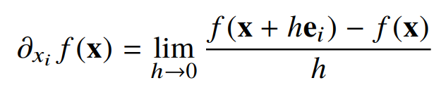

# 경사하강법(순한맛)

태그: 3주차

# Mathematics for Artificial Intelligence

## 미분이란?

- 미분(differentiation)은 변수의 움직임에 따른 함수값의 변화를 측정하기 위한 도구.
  - 최적화에서 제일 많이 사용하는 기법!
- `sympy.diff` 를 통해 미분 계산 가능.
  - `sym.poly` = 다항함수 표현

```python
import sympy as sym
from sympy.abc import x

sym.diff(sym.poly(x**2 + 2*x + 3), x)
```

## 미분 이해하기

- 미분은 함수 f의 주어진 점(x, f(x)) 에서의 접선의 기울기를 구함.
- 한 점에서 접선의 기울기를 알면 어느 방향으로 점을 움직여야 함수값이 **증가**하는지/**감소**하는지 알 수 있음.
  - **증가**시키고 싶다면 미분값을 **더하고**
    - 미분값이 음수라면 **왼쪽**으로 이동 ⇒ 증가
    - 미분값이 양수라면 **오른쪽**으로 이동 ⇒ 증가
  - **감소**시키고 싶다면 미분값을 **뺌.**
    - 미분값이 음수라면 **오른쪽**으로 이동 ⇒ 감소
    - 미분값이 양수라면 **왼쪽**으로 이동 ⇒ 증가
      ⇒ 고차함수에서 굉장히 유용하게 사용함.
- 미분값을 더하면 경사상승법(gradient ascent) ⇒ 함수의 극대값의 위치를 구할 때 사용.
- 미분값을 빼면 경사하강법(gradient descent) ⇒ 함수의 극소값의 위치를 구할 때 사용.
  - 경사상승/경사하강 방법은 극값에 도달하면 움직임을 멈춤.
    ⇒ 극값에선 미분값이 0이므로 더 이상 업데이트가 되지 않음!

## 경사하강법: 알고리즘

```python
Input: gradient, init, lr, eps, Output: var
------
# gradient: 미분 계산 함수
# init: 시작점, lr: 학습률, eps: 알고리즘 종료조건

var = init
grad = gradient(var)

while(abs(grad) > eps): # 1.
	var = var - lr * grad # 2.
	grad = gradient(var)
```

1. 컴퓨터로 계산할 때 미분이 정확히 0이 되는 건 불가능. eps보다 작을 때 종료하는 조건이 필요함.
2. `x - λf’(x)`를 계산하는부분. lr은 `학습률`로서 미분을 통해 **업데이트하는 속도를 조절**함.
   - 경사하강법 = **미분값을 주어진 변수에 빼줘야 함.**

- **함수가 f(x) = x^2 + 2x + 3 일 때 경사하강법으로 최소점을 찾는 코드**

```python
def func(val):
	fun = sym.poly(x**2, 2*x + 3)
	return fun.subs(x, val), fun

def func_gradient(fun, val):
	_, function = fun(val)
	diff = sym.diff(function, x)
	return diff.subs(x, val), diff

def gradient_descent(fun, init_point, lr_rate=le-2, epsilon=le-5):
	cnt=0
	val = init_point
	diff, _ = func_gradient(fun, init_point)
	while np.abs(diff) > epsilon:
		val = val - lr_rate*diff
		diff, _ = func_gradient(fun, val)
		cnt+=1

	print("함수: {}, 연산횟수: {}, 최소점: ({}, {})".format(fun(val)[1], cnt, val, func(val)[0]))

gradient_descent(fun=func, init_point=np.random.uniform(-2, 2))
```

## 변수가 벡터라면?

- 미분(differentiation)은 변수의 움직임에 따른 함수값의 변화를 측정하기 위한 도구로 최적화에서 제일 많이 사용하는 기법.
- 벡터가 입력인 다변수 함수의 경우 편미분(partialdifferentiation)을 사용함.



- `ei` 는 i 번째 값만 1이고 나머지는 0인 단위벡터


- x 방향의 편미분으로 계산을 한다면?
  y를 상수취급, **x에 대해 미분한 결과만** 나옴

```python
import sympy as sym
from sympy.abc import x, y

sym.diff(sym.poly(x**2 + 2*x*y + 3) + sym.cos(x + 2*y), x)
```

- 각 변수별로 편미분을 계산한 그레디언트(gradient) 벡터를 이용하여 경사하강/경사상승법에 사용할 수 있음

## 그레디언트 벡터?

주어진 함수의 극대점 혹은 극소점으로 향하는 방향을 알 수가 있는 것!


- ∇f(x,y)는 각 점 (x,y)에서 **가장 빨리 증가하는 방향**으로 흐름.
- -∇f 는 ∇(-f)와 동일하고 이는 각 점에서 **가장 빨리 감소하게 되는 방향**과 동일.

## 경사하강법: 알고리즘

- 위와 알고리즘은 동일하게 적용. 벡터는 절대값대신 노름(norm)을 계산해서 종료조건을 설정함.
- 함수가 f(x) = x^2 + 2y^2일 때 경사하강법으로 최소점을 찾는 코드

```python
def eval_(fun, val):
	val_x, val_y = val
	fun_eval = fun.subs(x, val_x).subs(y, val_y)
	return fun_eval

def func_multi(val):
	x_, y_ = val
	func = sym.poly(x**2, 2*y**2)
	return eval_(func, [x_, y_]), func

def func_gradient(fun, val):
	x_, y_ = val
	_, function = fun(val)
	diff_x = sym.diff(function, x)
	diff_y = sym.diff(function, y)
	grad_vec = np.array([eval_(diff_x, [x_, y_]), eval_(diff_y, [x_, y_])], dtype=float)
	return grad_vec, [diff_x, diff_y]

def gradient_descent(fun, init_point, lr_rate=le-2, epsilon=le-5):
	cnt=0
	val = init_point
	diff, _ = func_gradient(fun, val)
	while np.linalg.norm(diff) > epsilon:
		val = val - lr_rate*diff
		diff, _ = func_gradient(fun, val)
		cnt+=1

	print("함수: {}, 연산횟수: {}, 최소점: ({}, {})".format(fun(val)[1], cnt, val, func(val)[0]))

pt = [np.random.uniform(-2, 2), np.random.uniform(-2, 2)]
gradient_descent(fun=func_multi, init_point=pt)
```
